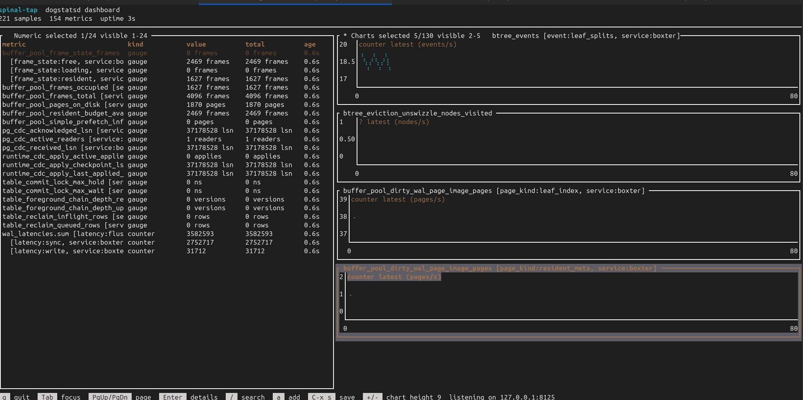

# spinal-tap

Small, fast terminal dashboard for DogStatsD metrics.

`spinal-tap` listens on UDP, parses DogStatsD packets, and renders selected counters, gauges, and
histograms in a `ratatui` dashboard. It is intended as a lightweight companion for projects using
e.g. [`fast-telemetry`](https://github.com/eden-dev-inc/fast-telemetry/): start it, point your
export at this, and watch current process behavior without persistence, querying, or a heavyweight
metrics stack.



## Run

```sh
cargo run --release -- config.example.toml
```

By default, if no config path is passed, `spinal-tap` looks for `spinal-tap.toml`. If that file is
missing, it starts with defaults and listens on `127.0.0.1:8125`.

Runtime changes can be saved back to the startup config path with Ctrl-X then Ctrl-S, or Ctrl-X then
`s`. If the app was started without a config path, this writes `spinal-tap.toml`.

## Config

```toml
listen = "127.0.0.1:8125"
history_points = 120
redraw_millis = 250

[[metrics]]
name = "requests"
view = "chart"
kind = "counter"
display = "rate"
unit = "req"

[[metrics]]
name = "queue.depth"
view = "numeric"
kind = "gauge"
display = "latest"
unit = "jobs"
```

Metric config matches the base metric name. Labelled DogStatsD series are split into distinct series
and grouped together in the UI:

```text
requests:1|c|#service:api,host:a
requests:1|c|#service:worker,host:b
```

Both lines match `name = "requests"`, but render as separate labelled rows/charts.

`kind` defaults to `auto`, which uses the kind from received DogStatsD samples. Set it explicitly
when adding a metric before samples arrive. `display` defaults to the current latest-sample view;
use `rate` for counters, or `latest`/`total` when you want that value plotted or shown as primary.

## Controls

- `Tab`, Left, Right: switch focus between numeric and chart panes.
- Up/Down or `j`/`k`: move the selected metric.
- PageUp/PageDown: page by the visible item count.
- Home/End: jump to first/last item in the focused pane.
- `/`: filter metrics by name or labels.
- `a`: add a metric from discovered traffic or a typed base metric name.
- Ctrl-X then Ctrl-S, or Ctrl-X then `s`: save the current runtime metric config.
- `+`/`-`: increase/decrease chart height.
- Enter: open the selected metric details pane.
- Enter while searching: keep the current filter.
- Esc while searching: stop editing and keep the current filter.
- Ctrl-W while searching: clear the filter input.
- `c` with an active filter: clear the current filter.
- In the add pane, Up/Down selects a discovered metric, Tab moves between fields, Left/Right changes
  view/kind/display, Ctrl-V cycles numeric/chart, Ctrl-K cycles kind, Ctrl-D cycles display, Ctrl-W
  clears text fields, Enter adds, and Esc cancels.
- In the details pane, `d` removes the selected base metric and all of its labelled series from the
  live dashboard.
- Esc or Enter: close the details pane.
- `q`, Ctrl-C, or Ctrl-X then Ctrl-C: quit.

## Scope

The current focus is fast, low-overhead live visibility for e.g. debugging or quick monitoring.

- No persistence between sessions.
- No querying or joins.
- Fixed-size per-series ring buffers for chart samples.
- Labels/tags are used for series identity and shown in details.

If you want more than this you probably want a real metrics collector, but I'm open to additions
where they keep the lightweight focus. Some features I want to add include:

- Adjust series ring buffer size
- Load or switch config from inside the app
- Reset / flush metric

## License

`spinal-tap` is licensed under the GNU General Public License v3.0 only. See [LICENSE](LICENSE).
